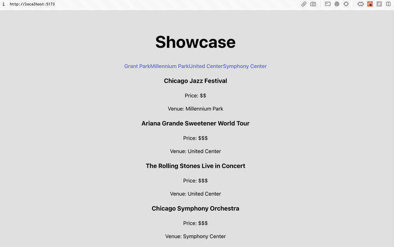

# WEB103 Project 3 - show-case

Submitted by: Noel Alfaro

About this web app: In this project, you'll create a virtual community space with an interactive interface that allows users to explore events by location. The user should be able to click on one of at least four locations and view events that have occurred or will occur there. Your virtual community can be real or imagined, but your site should help your target user find interesting stuff to do.

Time spent: **4** hours

## Required Features

The following **required** functionality is completed:

<!-- Make sure to check off completed functionality below -->

- [x] **The web app uses React to display data from the API**
- [x] **The web app is connected to a PostgreSQL database, with an appropriately structured Events table**
  - [ ] **NOTE: Your GIF or a screenshot added to this README must include a view of your Railway database that shows the contents of the table used by your app**
- [x] **The web app displays the title of the app**
- [ ] **A visual interface allows the user to select a Location they would like to view**
- [ ] **Clicking on a Location shows a list of all items from the Events table that corresponds to that Location**
- [ ] **Each Location detail page should have its own unique URL**

The following **optional** features are implemented:

- [ ] An additional page shows all possible `Events` that the user can sort and filter by `Location`
- [ ] `Events` display a countdown showing the time remaining before that event and appears with different formatting when the event has passed

The following **additional** features are implemented:

- [ ] List anything else that you added to improve the site's functionality!

## Video Walkthrough

Here's a walkthrough of implemented required features:

<!-- Replace this with whatever GIF tool you used! -->

GIF created with [Kap](https://getkap.co/) for macOS

## Notes

Describe any challenges encountered while building the app or any additional context you'd like to add.

## License

Copyright [yyyy] [name of copyright owner]

Licensed under the Apache License, Version 2.0 (the "License"); you may not use this file except in compliance with the License. You may obtain a copy of the License at

> http://www.apache.org/licenses/LICENSE-2.0

Unless required by applicable law or agreed to in writing, software distributed under the License is distributed on an "AS IS" BASIS, WITHOUT WARRANTIES OR CONDITIONS OF ANY KIND, either express or implied. See the License for the specific language governing permissions and limitations under the License.
